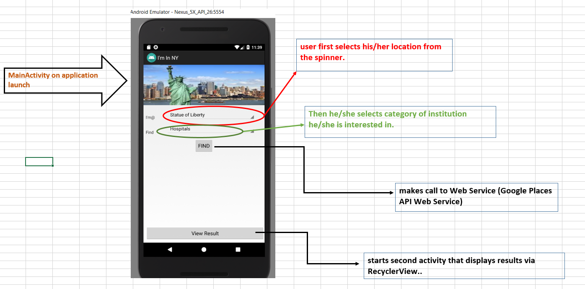

# Project Overview

Application allows user to select one specific site among 
different popular sites (like statue of liberty, empire state, manhattan, etc.
) within the state of New York and then select one point of interest
like restaurant, library, hospital etc. Application then uses Google
Places API Web Service to locate specific institutions around the site.

### Wireframe

### About the Web Service

Application uses Nearby Search Requests available with [Google Places API Web
Service](https://developers.google.com/places/web-service/search).

Nearby Search Request takes the form 
**maps.googleapis.com/maps/api/place/nearbysearch/output?parameters**
where required parameters are (i) key (application key), (ii) location (latitude/
longitude around which to retrieve information), (iii) radius (the distance (in meters) 
within which to return place results.)

